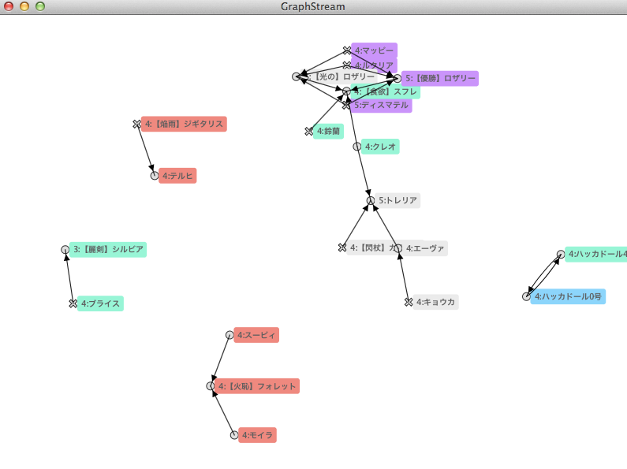

# Gomaotsu otomeList Visualizer
Gomaotsu otomeList Visualizer will visualize your otome list.



## How to use this application
### Requirements
This application requires that your computer is connected to the internet.
I have tested this application with Java 8 (1.8.0_40) on MacOSX.

### Download and setup
#### Clone this project
```sh
cd ~/git/
git clone https://github.com/funasoul/gomaotsu.git
```
#### Launch Eclipse and import as Maven project.
1. [File] -> [Import] -> [Maven] -> [Existing Maven Project] -> [Next]
2. Navigate to ```~/git/gomaotsu``` -> [Next]
3. Select ```/pom.xml``` which you will see in the dialog.
4. Press [Next], then Eclipse will create a new project.
That's it!
